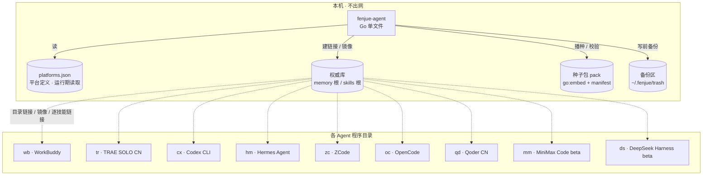
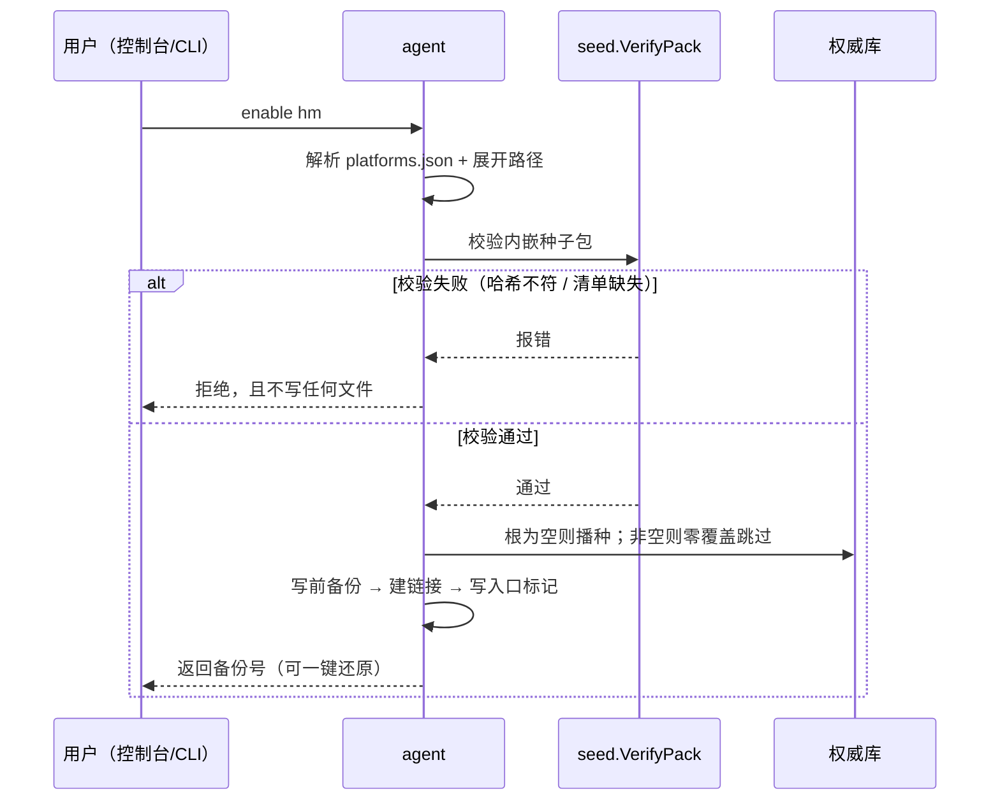
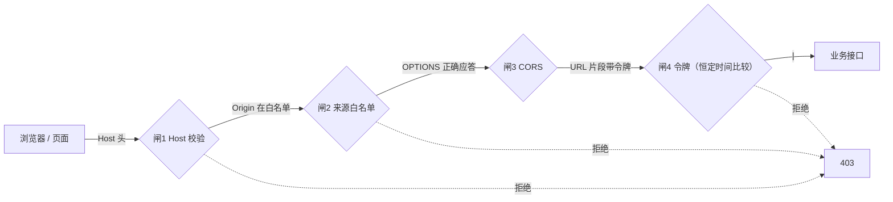

# Architecture

一句话：**一个 Go 单文件程序 + 一份平台定义文件 + 一份权威库，让多个 Agent 看到同一份记忆与技能。**

## 1. 全局视图

实线是程序行为，虚线是文件系统层面的链接关系。**权威库只有一份**，各 Agent 目录里的是链接，因此任何一端改内容，其余端立即可见。

## 2. 模块职责

| 模块 | 职责 | 关键约束 |
|---|---|---|
| `internal/platform` | 读 `platforms.json`，展开路径变量 | 路径只允许 `~` / `%VAR%` / `$VAR`，禁个人绝对路径 |
| `internal/seed` | 首次播种 + **完整性校验** | 零覆盖：非空库一律跳过；校验失败 fail-closed |
| `internal/mount` | 三种挂载形态的具体实现 | 原子操作：临时目录建好再 rename，失败回滚 |
| `internal/inject` | 在 Agent 的入口文件写入标记 | 幂等；软关闭只停注入、保留链接 |
| `internal/safeio` | 备份、回收、路径校验、Windows ACL | 任何写操作前先备份 |
| `internal/server` | 回环 HTTP 服务 + 四道安全闸 | 只绑 `127.0.0.1`；除健康检查外都要令牌 |
| `internal/state` | 状态核验（verify） | **测不到就报 UNVERIFIED，不折算为通过** |
| `cmd/fenjue-agent` | CLI 入口 + 前端内嵌 | 前端必须先构建 |

## 3. 挂载的四种形态

| 形态 | 用在哪 | 关闭的含义 |
|---|---|---|
| 目录链接 | 默认 | 断开链接（软关闭时保留链接、只停注入） |
| 物理镜像 | `cx` | **停止同步**，已复制过去的文件不会自动删除 |
| 逐技能链接 | `hm`，约 160 条 | 批量摘除，批量恢复 |
| 不写穿 | 任何根本身已是链接时 | 完全不碰 |

## 4. 首次启用一条平台时发生什么

**为什么校验在播种之前**：校验失败时若已经写了一部分文件，就留下半成品，用户还得手工清理。先校验后写入，失败面就是零。

## 5. 令牌在请求链路上的位置

令牌通过 URL 片段携带：片段不会随 HTTP 请求发给服务器，也不会进入 Referer，因此从浏览器地址栏取到它的那次导航不会把它泄露给服务器日志。

## 6. 三条不变量

代码里到处在守的东西，写在这里方便对照：

1. **零覆盖**：已存在且非空的库，任何情况下都不被播种内容改写。
2. **可逆**：写前必备份，响应里回传备份号；软关闭不删链接。
3. **测不到就说测不到**：`state` 与 `parity` 都有 UNVERIFIED 态，且明确「UNVERIFIED 不是通过」。

## 7. 延伸阅读

- [FAQ](FAQ.md) —— 常见问题
- [安全策略](SECURITY.md) —— 四道闸与已知限制
- [贡献指南](CONTRIBUTING.md) —— 改种子包或加平台的规约
